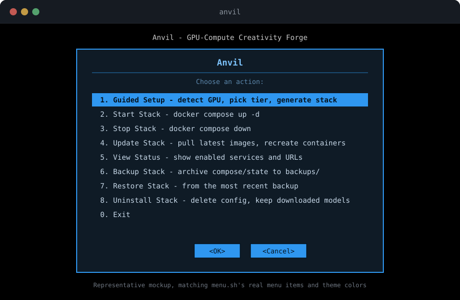
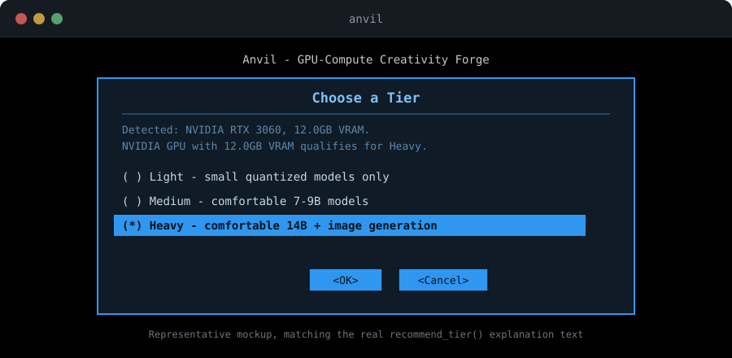
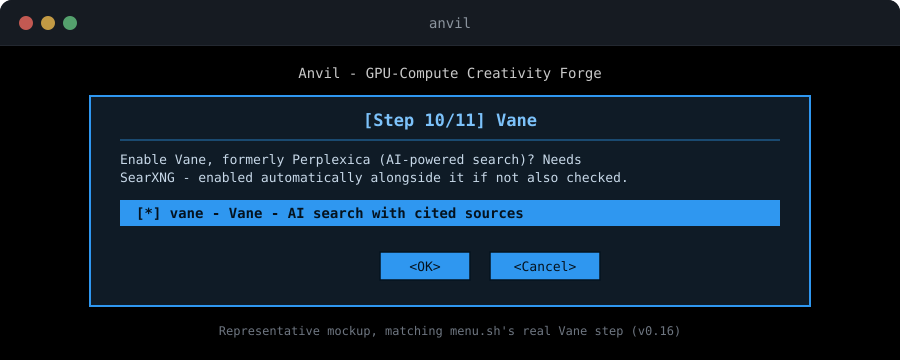

# Anvil

<p align="center">
  <a href="LICENSE"></a>
  
</p>

<p align="center">
  
</p>

<p align="center">
  📖 <a href="ROADMAP.md">Roadmap</a> · <a href="CLAUDE.md">Architecture &amp; Verification Log</a> · <a href="https://cyb3rron1n.github.io/">Sibling Projects</a> · <a href="docs/images/favicon.svg">Favicon</a>
</p>

Turn your GPU into a local AI/creative server. Anvil detects your real VRAM and generates a Docker Compose stack sized to what your card can actually handle — no manual sizing guesswork, no LLM in the decision path.

- 💬 **Chat** — Ollama + Open WebUI, every tier, GPU or not
- 🎨 **Image generation** — ComfyUI and/or InvokeAI at Heavy tier (NVIDIA/AMD/Intel Arc)
- 📚 **RAG** — Qdrant + text-embeddings, wired into Open WebUI's document retrieval
- 🎙️ **Voice** — Whisper speech-to-text + Kokoro text-to-speech
- 🔀 **n8n** — visual workflow automation
- 🌐 **LiteLLM** — one endpoint for local + cloud LLM providers
- 🔍 **SearXNG + Vane** — private metasearch and AI-powered search with cited sources
- 🧩 **LocalAI** — an Ollama alternative with broader model format support

Guided TUI by default (`anvil`), or scriptable end to end (`anvil --non-interactive --yes`). Sibling project [Vulcan](https://github.com/Cyb3rRon1n/vulcan) does the same for a self-hosted media stack — Anvil can detect a co-located Vulcan install and merge into its dashboard automatically.

**Status:** real, working build, not a proof of concept. Every service except ComfyUI/InvokeAI has been started for real and hit with real requests, not just schema-validated — see [ROADMAP.md](ROADMAP.md) for what's shipped and [CLAUDE.md](CLAUDE.md) for exactly what's verified and what isn't. The one open gap: no discrete GPU exists in this project's dev environment yet, so image generation has never run against real GPU compute.

## Quick start

```bash
git clone https://github.com/Cyb3rRon1n/anvil.git
cd anvil
sudo ./install
```

`sudo ./install` bootstraps a local virtual environment on first run, then opens the guided TUI. Detects your CPU/RAM/disk and every GPU with real dedicated VRAM, recommends a tier, asks what you want, and generates `stack/docker-compose.yml` — with the option to start it immediately. A host with no discrete GPU gets Light tier (Ollama on CPU, plus optional RAG/voice/n8n/LiteLLM/SearXNG/Vane/LocalAI) instead of a tier it can't actually deliver on.

<p align="center">
  
</p>

```bash
sudo ./install --plain                           # plain CLI prompts instead of the TUI
sudo ./install --non-interactive --yes --start    # scripted use
```

## Why a separate project, not a Vulcan mode

Scoped out during a Vulcan session that considered and rejected folding "creativity build" services (local LLMs, ComfyUI) into Vulcan directly. These aren't just more services for Vulcan's existing service picker — they need a fundamentally different sizing model (VRAM-bound, not CPU/RAM-bound), a GPU-VRAM detection layer Vulcan's `detect_gpu()` was never built for (vendor presence only, never VRAM amount — and, found while researching this, not even reliably vendor presence: see CLAUDE.md), and a different category of real quirks (model download/storage management, CUDA/ROCm toolkit prerequisites). Full reasoning in [CLAUDE.md](CLAUDE.md).

Separate doesn't mean disconnected: if Anvil finds a co-located Vulcan install, `--integrate-vulcan` cross-checks real port conflicts and adds Anvil's services to Vulcan's Homepage dashboard — one place to see both stacks. Standalone by default; silent and unchanged if no Vulcan install is found.

## What's in the stack

- **Dashboard** — a lightweight landing page at `http://<host>:8080` linking to whatever's enabled in your stack. Generated fresh every time, using your host's real LAN-facing IP so it works when opened from another device, not just `localhost`.
- **Ollama** — local LLM runtime, OpenAI-compatible API. Pulls and manages its own models.
- **Open WebUI** — ChatGPT-style frontend for Ollama. No setup beyond picking a model on first visit.
- **ComfyUI** *(Heavy tier, NVIDIA, AMD, or Intel Arc)* — node-based image generation. Wires into Open WebUI for inline image generation once both are up — Anvil tells you exactly where to click (Admin Panel > Settings > Images) since that connection is a runtime setting, not something a compose file can do for you. Model checkpoints need to be placed manually; unlike Ollama, ComfyUI doesn't manage its own downloads. NVIDIA and Intel Arc's images bundle ComfyUI-Manager (for installing custom nodes/models from inside ComfyUI itself); AMD's doesn't, so Anvil prints the exact one-time fix commands rather than pretending it's there.
- **InvokeAI** *(Heavy tier, NVIDIA or AMD)* — a simpler alternative to ComfyUI's node-based UI: a unified canvas with a real built-in Model Manager, so checkpoints can be downloaded straight from HuggingFace repo IDs or curated starter models — no manual file placement. No Intel Arc image exists yet (only a non-Docker community workaround). AMD's image needs the separate AMD Container Toolkit registered with Docker (`runtime: amd`) rather than the plain device passthrough Ollama/ComfyUI's AMD blocks use — Anvil warns if it's missing.
- **RAG (Qdrant + text-embeddings)**, **voice (Whisper + Kokoro TTS)**, **n8n** *(every tier, no GPU needed, on by default)* — CPU-only, vendor-agnostic optional services, real-Docker-verified. RAG/voice wire into Open WebUI's own admin-panel settings (Anvil tells you exactly where to click). n8n needs a one-time setup wizard — no env var can pre-seed its admin account (checked directly against its real source, twice), so Anvil generates the login and tells you to enter it once at first visit.
- **LiteLLM**, **SearXNG**, **Vane** *(formerly Perplexica)*, **LocalAI** *(every tier, no GPU needed, off by default)* — same CPU-only category, more specialized. LiteLLM ships a working starter config proxying Ollama; add your own models/cloud API keys. Vane needs SearXNG to search at all — requesting it alone auto-enables SearXNG too. LocalAI is a broader-format Ollama alternative, works out of the box, no manual wiring.

Tiers are based on your GPU's real detected VRAM: **Light** (any real VRAM, small quantized models), **Medium** (8GB+, comfortable for 7-9B-class LLMs like Llama 3.1 8B), **Heavy** (12GB+, comfortable for 12-14B-class LLMs like Qwen2.5 14B, plus ComfyUI/InvokeAI). Anvil shows you this breakdown for whichever tier you pick, not just its name. See [CLAUDE.md](CLAUDE.md) for the real Ollama/SDXL numbers these are based on.

## What's reused from Vulcan vs. genuinely new

See [CLAUDE.md](CLAUDE.md) for the full breakdown — architecture pattern and project discipline carry over, the tier/sizing model and GPU detection do not.

## Screenshots

<p align="center">
  
  
</p>

<sub>Representative mockups matching the real whiptail theme and copy, not literal captures — see <a href="installer/menu.sh"><code>menu.sh</code></a>.</sub>

## License

[MIT](LICENSE)
